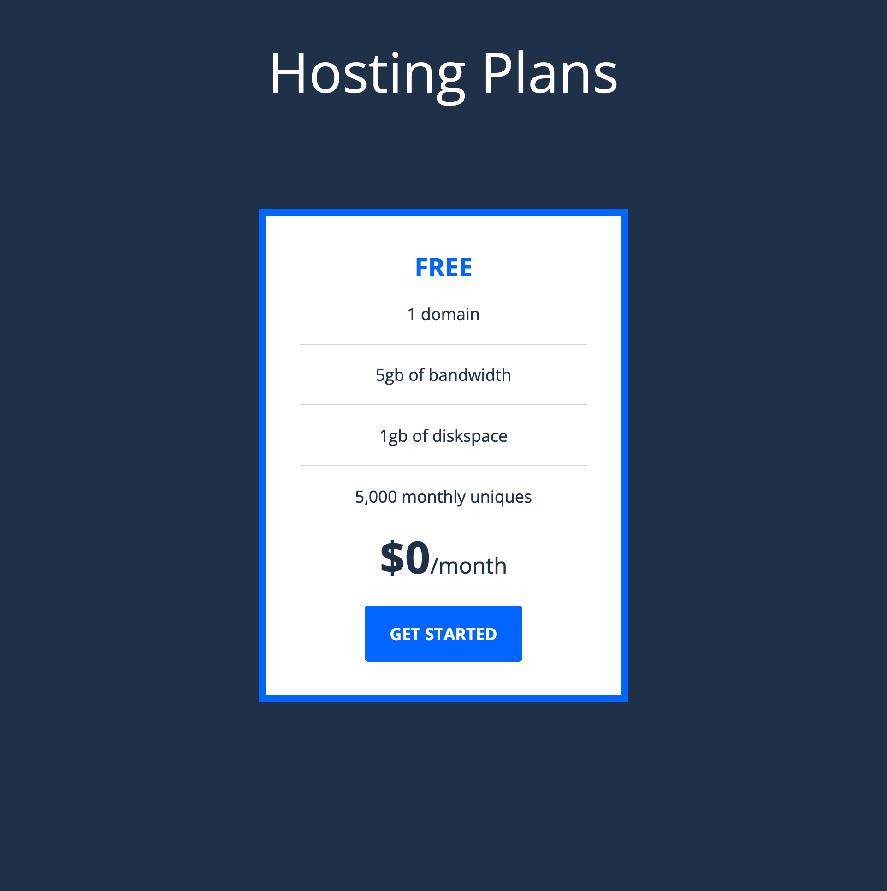
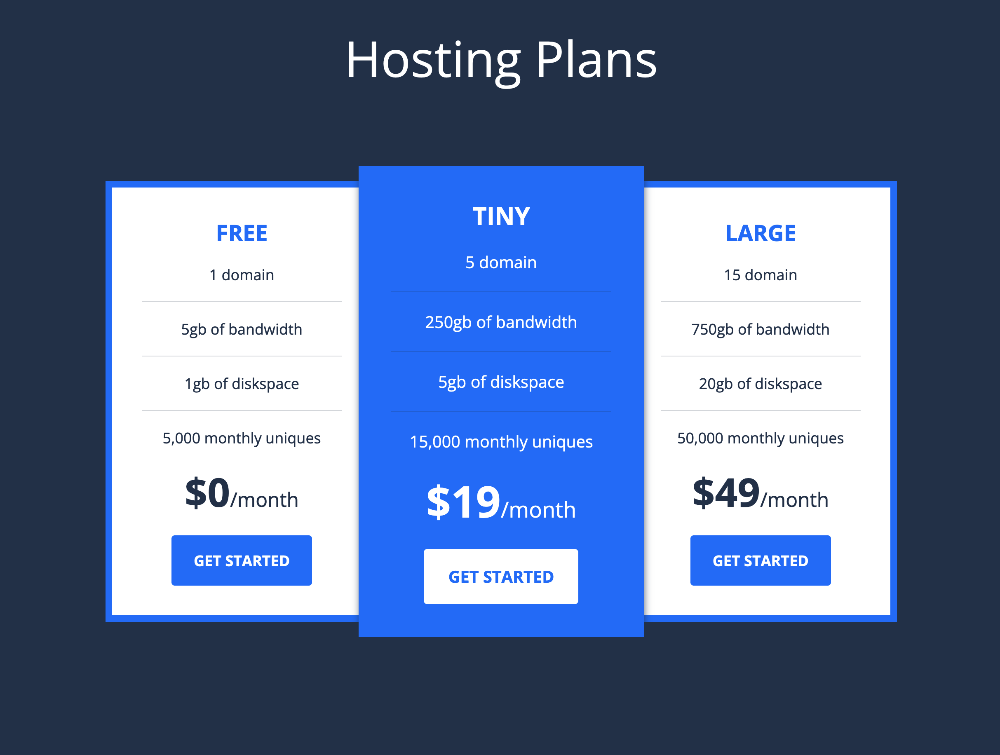

# TD2 SASS - Hosting Plans

## DS

```
/* colors */
color-neutral-100: #fff
color-neutral-900: #1f3049
color-primary-400: #0066ff

/* font-families */
ff-sans: "Open Sans", sans-serif;

/* font-sizes */
fs-900: 60px
fs-800: 48px
fs-700: 27px
fs-600: 24px
fs-400: 18px

/* font-weights */
fw-400: 400
fw-700: 700

/* size/spacing values */
size-2: 2px
size-4: 4px
size-8: 8px
size-12: 12px
size-16: 16px
size-20: 20px
size-24: 24px
size-32: 32px
size-36: 36px
...
```

## Exercice 1 : Création d'une card 'plan' : Nesting + Lists/Maps + Variables CSS

**Creation d'un Projet Vite + Sass**

Création d'une card 'plan' en utilisant des `List` et `Maps` Sass pour initialiser les Variables CSS.

Vous pouvez contextualiser les variables CSS au niveau du composant card avec des variables privées: les variables sont définies en fonction de leur contexte, ce qui facilite la gestion des styles de votre application.

```css
--_bg
--_fg
--_heading
--_line
--_btn-text
--_btn-bg
--_btn-text-hover
--_btn-bg-hover
--_plan-shadow
--_plan-scale
```

exemple : `--_bg: var(--clr-neutral-100);`

Base de code

```html
<section class="plan">
  <h2 class="plan__title">Free Plan</h2>
  <ul class="plan__features">
    <li class="plan__feature">1 domain</li>
    <li class="plan__feature">5gb of bandwidth</li>
    <li class="plan__feature">1gb of diskspace</li>
    <li class="plan__feature">5,000 monthly uniques</li>
  </ul>
  <p class="plan__price">$0<span>/month</span></p>
  <a href="/" class="button">Get Started</a>
</section>
```

## Exercice 2 : Dark card

Créer un modifier `--active` pour créer une variante de la card 'plan'.
Créer un modifier `--dark` pour créer une variante de la card 'plan'.

## Exercice 3 : Refactoring

Utilisez des `partials` pour restructurer votre code.

Structure du dossier src :

```
scss
L abstracts/
L bases/
L layouts/
L components/
style.scss
```

## Exercice 4 : Page Hosting Plan



Tiny
5 domain
250gb of bandwidth
5gb of diskspace
15,000 monthly uniques
$19/month

Large
15 domain
750gb of bandwidth
20gb of diskspace
50,000 monthly uniques
$49/month
